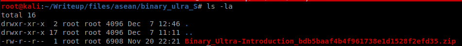

# [BINARY] Binary Ultra - 50 Pts.
 
We're given with this file.

 
We did the following and it turned out it is a program for Windows 64 bit.

 

Let's check if the flag string is embedded as is in the PE.
If not, we'll have to do static analysis and dynamic analysis
later.

LOL!!! It did!
 
:D :D :D
Thank you for reading!

