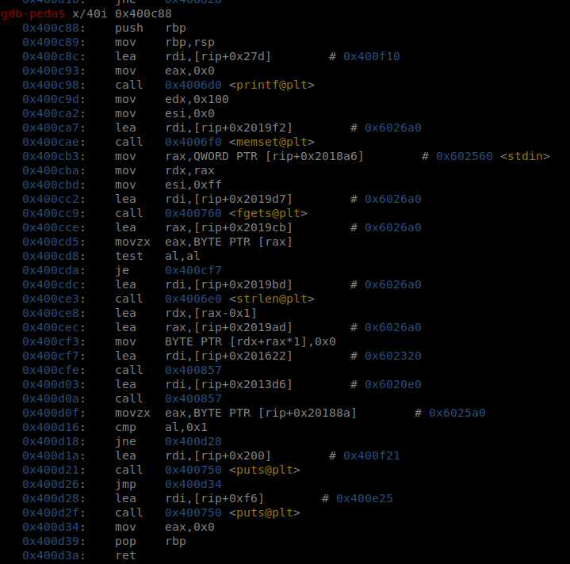
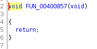
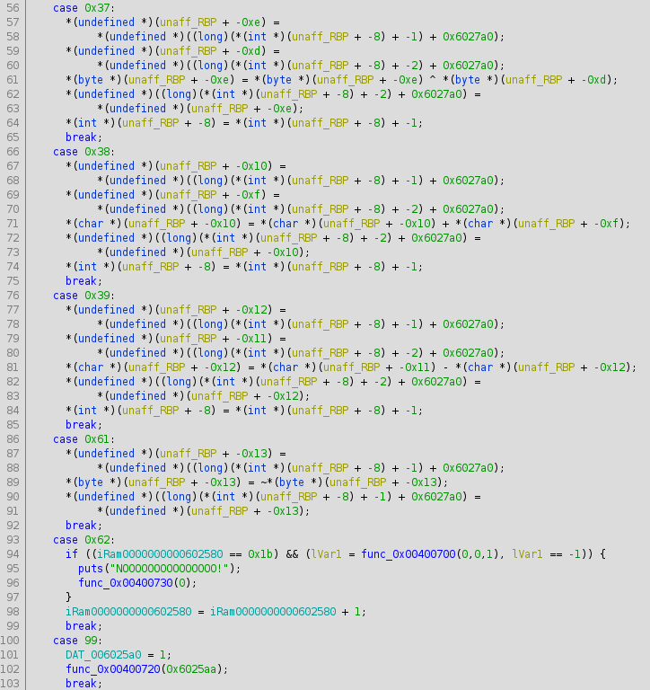
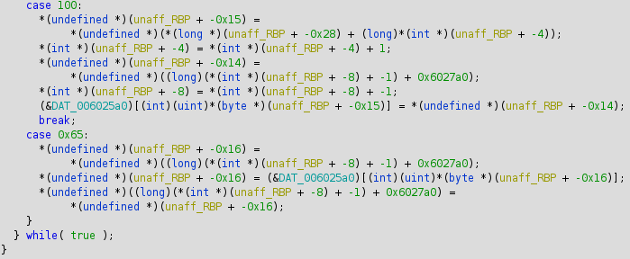

# [REVERSING] Discount VMProtect - 465 Pts.
<br />

# Challenge Description:


<br />
Then the challenge gives us this file:


<br />
Let's see what the ELF file does.


It basically asks for a password then checks if it matches to the password embedded inside the executable, which is also probably the flag. 

<br />
Let's run gdb on it and do static analysis. Let's check for functions and how much symbols is left since the ```file``` command says it is stripped.


Hmmm... There is no main and only plt entries remained. Let's find the entry point and the main then.
<br />
The entry point is at ```0x400770```.


<br />
Then our main address is 0x400c88.

<br />

This is the whole main assembly code


Summary of main:
- The program asks for user input and stores it to 0x6026a0, calls 0x400857, then if the first byte from 0x6025a0 is 1, then we got the password.

<br />
Let's check Ghidra if we got the same analysis to it.

We got the same analysis. Great! We noticed also that the 0x400857 is called two times. Let's see what 0x400857 does.
<br />
In Ghidra:

Hmmm... weird, it only returns. Let's check gdb then.
<br />

In GDB:

It looks like this function offers a lot more than just returning. It pushes 0x2361ca to the stack then it XORs it with 0x636465. The value after XORing is 0x40087f then returning. Since 0x40087f is the top of the stack, the code actually jumps to that address instead of going back to main. Let's check Ghidra what's inside 0x40087f.



Woah! I think we just stumbled a treasure! However, there's a lot of code and it looks scary. Second, what's the deal with this loop? After a lot of headbanging and searching, I found this article about VM protectd binaries. I suggest to give it a read. [VM Protected Binaries Article](https://resources.infosecinstitute.com/reverse-engineering-virtual-machine-protected-binaries/#gref). 
<br />
TL;DR: A Binary that's VM protected has its own set of "instructions", has a function that acts like a processor then reads the instructions, and has its own memory (stack, heap, etc. depending on the design). The 0x40087f is actually the function that executes those instructions. We can also see the values in the switch cases. These are the opcodes of the instructions.
<br />
Now that we know what the big loop is, we have to answer the following questions:
a) Where does the binary get the instructions?
b) What does each opcode do?
c) This is the main part of the program therefore the flag is connected to it somewhere and somehow. So where is it?
<br />
Let's answer (a).
Let's go back at 0x400857 before jumping to 0x40087f


Before the XOR operation, we can see that rdi value is being stored to rbp-0x28:
- rbp-0x28 = rdi
- rbp-0x8 = 0x0
- rbp-0x4 = 0x0

Also, a very important note, those values above appeared in every operation for every opcode inside the big loop.
But what is the value of rdi? Going back to main.


Addresses 0x602320 and 0x6020e0 are passed as arguments to 0x400857 function.
What's inside in this address?

Contents: of 0x602320


Contents: of 0x6020e0


We can see many of the bytes are starting in 3 (i.e. 0x32, 0x36, 0x33 etc.)
Could this be the instructions? It most likely is but to confirm things let's go Ghidra and check the decompiled code at 0x40087f.


Basically, what it says: 
\[rbp-0x17\] = \[rbp-0x28\]\[rbp-0x4\]; #access the byte from \[rbp-0x28\] at offset \[rbp-0x4\]
\[rbp-0x4\] += 1

Then the value at \[rbp-0x17\] is being used to check against the cases for opcodes thus the addresses 0x602320 and 0x6020e0 contains the values of instructions. We should also notice that offset lies in \[rbp-0x4\] therefore this is the instruction pointer. 
<br />
Takeaways:
\[rbp-0x28\] is the base address. The value is set in the 0x400857 through rdi which came from the main function
\[rbp-0x4\] is the instruction pointer.
\[rbp-0x8\] ??? -> we don't know this yet.
<br />
Let's answer (b):
Since there are a lot of opcodes, this is the list of each opcode and what they do.
<br />
0x30 ->
- it breaks the loop, ending the execution of the instructions

0x31 -> 0x4008cf - 0x400913
- x = data supplied 
- gets data from 0x6025a0[x] then pushes it to stack

0x32 -> 0x400918 - 0x400940
- copies the top stack value then pushes that value to the stack

0x33 -> 0x400945 - 0x40097d
- Loads a character from user buffer using top value of stack
- Replaces that top value stack from the loaded character from user buffer

0x35
- top_stack = (top_stack >> 1) | (top_stack << 7) 
- Rotate to right 1 bit

0x34 -> 0x400982 - 0x4009bc
- Changes the instruction pointer value if the top of stack is 0
- let x = supplied value, if top_stack == 0, rbp-0x4 = x
- pop data

0x36
- x = data supplied
- Push x to the stack

0x37
- xors two values from the stack then saves it to the -2 of the stack  
- then "pops" the stack, making the new value new top of stack

0x38
- adds two values then saves it to the -2 of the stack
- then "pops" the stack, making the new value new top of stack

0x39
- subtracts two values (2nd top - top) then saves it to the -2 of the stack
- then "pops" the stack, making the new value new top of stack

0x61
- top_stack = neg(top_stack)

0x62
- if (\*0x602580 == 0x1b) and ptrace == -1) print ("NOOOOOOOOOO!"), else \*0x602580 += 1
- ptrace == -1 checks if debugger is present

0x63 -> 0x400bd2 - 0x400bef
- strcpy(0x6025aa, 0x6020a0)
 
0x64 -> 0x400bf4 - 0x400c3b
- x = data supplied by bytecode
- y = top stack value
- 0x6025a0[x] = y
- pop data

0x65 
- top_stack = 0x6025a0\[top_stack\]

<br />
Takeaways:
- Notice that there is a lot of stack operations yet we don't know where is the base address of the stack and what points to the top of the stack. Let's take snippet from Ghidra code.


-We can see that \[rbp-0x8\] is the offset from the 0x6027a0 and adds 1 to itself whenever it saves a value. 
(You can also check the other cases. There are cases in which \[rbp-0x8\] decreases 1 whenever it does an operation)

\[rbp-0x28\] is the base address. The value is set in the 0x400857 through rdi which came from the main function
\[rbp-0x4\] is the instruction pointer.
\[rbp-0x8\] is the stack pointer
0x6027a0 is the base address of the stack

<br />
Finally, let's answer (c). Where is the flag?

Let's look at the first set if instructions at address 0x602320:


0.  31, data = 80
2.  63
3.  32
4.  32
5.  64, data = 80
7.  33
8.  34, data = 12
a.  36, data = 1
c.  38
d.  32
e.  32
f.  39
10. 34, data = 3
12. 36, data = 23
14. 39
15. 34, data = 1b
17. 36, data = 0
19. 64, data = 0
1b. 36, data = 0
1d. 64, data = 80
1f. 30 



Instructions 0-2: 
- gets data 0x6025a0[80] then push to stack
- then strcpy(0x6025aa, 0x6020a0) and sets 0x6025a0[0] = 1. Remember that this has to be 1 in order to get "Yay" printf in the main function.

Instructions 3-10: 
- counts the length of the user input then saves it to 0x6025a0[80]

Instructions 12-1d: 
- 0x23 - (length of user input)
- if not the result above 0, set 0x6025a0[0] = 0 (execution jumps directly to 1b)
- set 0x6025a0[80] = 0

Instruction 1f:
- break from the loop. Stop execution.

<br />
Hmmm... This set of instruction is not that interesting, except for instruction 2 which copies a gibberish from 0x6020a0 to 0x6025aa.

<br />
Nevertheless, we were able to grasp the execution for the first time. Let's go to instruction set from 



0.  31, data = 80
2.  32
3.  32
4.  64, data = 80
6.  33
7.  32
8.  34, data = 28 #This jumps directly to opcode 30 -> exit instruction
a.  35
b.  36, data = 63
d.  37
e.  36, data = 98
10. 38
11. 61
12. 62
13. 31, data = 80
15. 36, data = a
17. 38
18. 65
19. 39
1a. 34, data = 20
1c. 36, data = 0
1e. 64, data = 0
20. 36, data = 1
22. 38
23. 32
24. 32
25. 37
26. 34, data = 2
28. 30 #Exit instruction



Instructions 0 - 12:
- Saves how many characters to the 0x6025a0[80] have been "processed"
- The character of every user input is being processed:
- The processing is in this order :
  
a) char = char rotates to right 1 (Instruction a)

b) char = char ^ 0x63 (Instruction d)
  
c) char = char + 0x98 (Instruction 10)
  
d) char = neg(char) (Instruction 11)

Instruction 13 - 1e
- Compares the processed character to the 0x6025a0[0xa + char counter] \(Instructions 13-1a\). It means, it compares to every character to the 0x6025aa, the address where the destination address of strcpy during the first instruction set! That's it! This could be the flag! Let's get those raw data and reverse the process to each its bytes.



raw_data = '\x18r\xa2\xa4\x9d\x89\x1f\xa2\x8d\x9b\x94\rm\x9b\x95\xec\xec\x12\x9b\x94#\x16\x9bl\x13\x0em\r\x96\x8d\x0e\x90\x13\x97\x8a\xbb\xcfd~\xd3\x1a@#\xec\xdf\x00\x00\x00'

<br />
With following reversal process:


def get_flag(raw_data):
	flag = ""
		for char in raw_data:
	     		char = ord(char) ^ 0xff
			char = (0x100+char - 0x98) & 0xff
			char = char ^ 0x63
			char = chr(((char << 1) | (char>> 7)) & 0xff )
			flag += char
	return flag


 
The flag is:

*X-MAS{VMs_ar3_c00l_aNd_1nt3resting}*
<br />
NICE! We are able to get flag!
The rest of the instructions were actually just looping back for the rest of the characters to be processed. 1 character mistake actually will make 0x6025a0[0] = 0 (Instructions 1c and 1e)
<br />
Thank you for reading this long writeup
<br />
Author's comment:
I've learned a lot doing this challenge and the writeup. Thank you reader for putting it up until the end and I hope you've also learned something in this writeup. 


