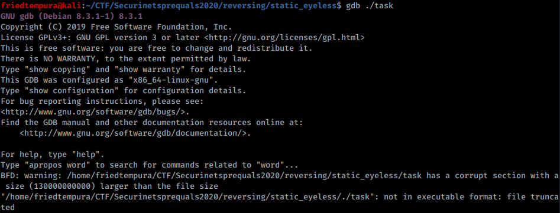

# [REVERSING] static EYELESS - 834 pts.

We're given a file:


<br />
When the file is run, this is the output:


<br />
Running it with gdb crashes the debugger since its header is corrupted:

But instead of fixing the file header, let's use another method.

<br />
Analyzing the ELF binary with Ghidra. After loading the binary and be analyzed by Ghidra, we check on the symbol tree, under "Functions" folder and select the address that is highlighted: (Address 0x100820)

We will be able to see the decompiled code now (You can get the full code [here](assoc_files/static_eyeless_1.c)). These are the interesting parts:
### The encrypted flag:
```c
  local_128._0_4_ = 0xd1;
  local_128._4_4_ = 0x1e;
  local_120 = 0xdb;
  local_11c = 0xfb;
  local_118 = 0x74;
  local_114 = 0xcb;
  local_110 = 0x15;
  local_10c = 0xdd;
  local_108 = 0xfa;
  local_104 = 0x75;
  local_100 = 0xd9;
  local_fc = 0x4b;
  local_f8 = 0xda;
  local_f4 = 0xe8;
  local_f0 = 0x73;
  local_ec = 0xd1;
  local_e8 = 0x4f;
  local_e4 = 0xcc;
  local_e0 = 0xe7;
  local_dc = 0x36;
  local_d8 = 0xcc;
  local_d4 = 0x4e;
  local_d0 = 0xe7;
  local_cc = 0xfc;
  local_c8 = 0x36;
  local_c4 = 0xc1;
  local_c0 = 0x10;
  local_bc = 0x8d;
  local_b8 = 0xaf;
  local_b4 = 0x7b;
  local_b0 = 0xa8;
```
<br />
### Initializing values:
```C
  iVar2 = FUN_0010080a(); // The function returns 0x15. Check the full code :D
  iVar3 = FUN_00100815(); // The function returns 0xfb. Check also.
  uVar5 = (ulong)local_118;
  dVar9 = (double)(int)local_128; //To note: local_128 == local_128._0_4
  iVar4 = local_128._4_4_ + -0x14;
  cVar1 = (char)local_128._4_4_;
  puts("Hello REVERSER!");
  lVar7 = ptrace(PTRACE_TRACEME,0,0,0);
  lVar7 = (long)((int)lVar7 + 1) *
          ((long)iVar4 *
           (long)((dVar9 * (((double)iVar3 * 29.00000000 + 58.00000000) * (double)uVar5 +
                           110.00000000) + 141.00000000) * (double)iVar2 + 20.00000000) >>
          (cVar1 - 0x16U & 0x3f)) * 0xc0fe;
```
From the code above, we can tell the values of the variables. 
```C
iVar2 = 0x15;
iVar3 = 0xfb;
uVar5 = 0x74; //Part of the encrypted flag
dVar9 = 209.000; //Also part of the encrypted flag but turned into type double
iVar4 = 0x1e - 0x14 = 0xa 
cVar1 = 0x1e;
lVar7 = 0 //0 Since ptrace returns 0 when it is not being debugged. To note: The second lVar7 is not calculated yet.
```
After plugging in the values of the variables involved in the long expressions, we should be able to arrive at this expression:
```C
lVar7 =  ((long)(0x1e - 0x14) * (long)((((double)(int)0xd1) * (((double)0xfb * 29.00000000 + 58.00000000) * (double)(ulong)0x74 + 110.00000000) + 141.00000000) * (double)0x15 + 20.00000000) >> (0x1e - 0x16U & 0x3f)) * 0xc0fe;
//Which has a final value
lVar7 = 0x68eb87ba216
```
<br />
### Getting and encryption of user input:
```C
  printf("Give me the passcode:");
  if (lVar7 < 0) {
    lVar7 = lVar7 + 0xff;
  }
  fgets(local_58,0x31,_DAT_00302010);
  local_234 = 0;
  local_238 = 0;
  local_228 = lVar7 >> 8;
  while (sVar6 = strlen(local_58), (ulong)(long)local_238 < sVar6) {
    if (local_228 == 0) {
      local_228 = lVar7 >> 8;
    }
    auStack504[local_238] = (int)local_58[local_238] ^ (uint)local_228 & 0xff;
    local_228 = local_228 >> 8;
    local_238 = local_238 + 1;
  }
```
From the code above, the user input is being looped through and each character of user input is being XORed to the bytes of lVar7. The resulting byte is stored in another variable called auStack504. This is what XOR op looks like:
```C
// Let VAL = "USER INPUT" = 
KEY = a2-7b-b8-8e-06-a2-7b-b8-8e-06
XOR   |  |  |  |  |  |  |  |  |  |
VAL = 55-53-45-52-20-49-4e-50-55-54
```
Notice that 0x16, the very first byte of lVar7, is not used since before XORing, lVar7 is shifted 8 bits to the right. 
<br />
Since we already know how the user input is encrypted, let's decrypt the encrypted flag.
```python
key = 0x68eb87ba216
contents = "d11edbfb74cb15ddfa75d94bdae873d14fcce736cc4ee7fc36c1108daf7ba8"

decr_char = key >> 8

for item in contents:
	if decr_char <= 0:
		decr_char = key >> 8

	char = int("0x"+item, 16)
	char = char ^ (decr_char & 0xff)
	print(chr(char),end="")

	decr_char = decr_char >> 8

print("")
```

And Viola! We got the flag!

<br />

flag:
securinets{0bfus4ti0n5_r0ck5!}
<br />
Thanks for reading!
