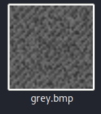
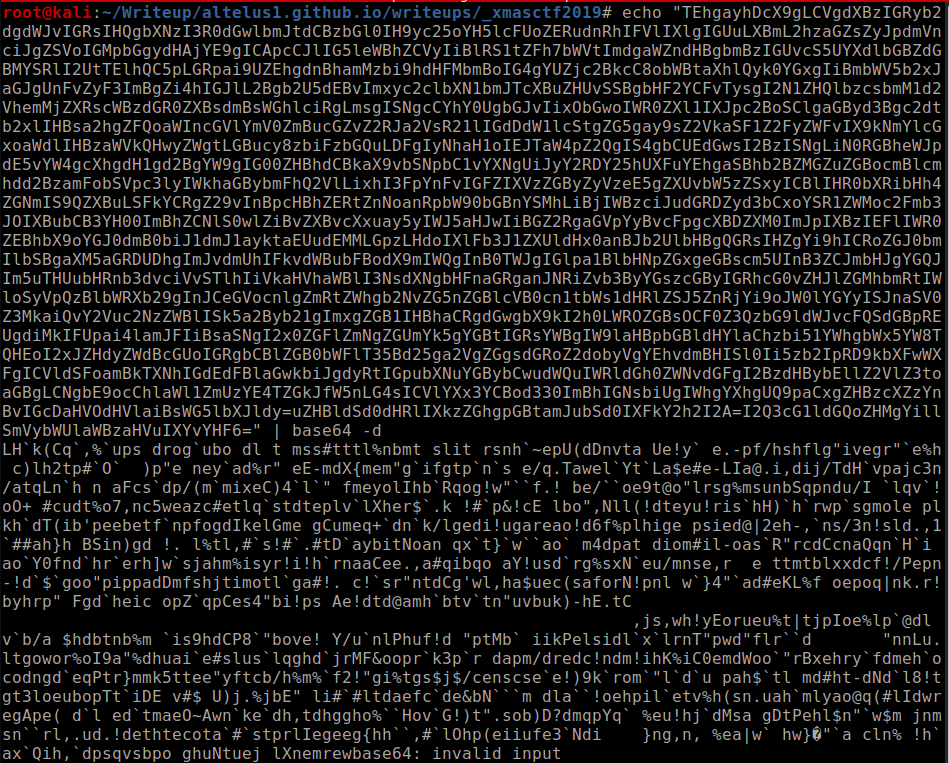

# [MISC] 45 Shades of Christmas - 280 Pts.

# Challenge Description

 

We are given a BMP file. Looks

Looks like we have to work on it pixel by pixel. Let's open it.
I used PIL python module.


from PIL import Image
img = Image.open('grey.bmp')
pix = img.load()


 
Now, let's see the values of the pixels of if there are anything unusual to them.

pixels = []
for y in range(img.size[1]):
  row = []
  for x in range(img.size[0]):
    row.append(pix[x,y])
  pixels.append(row) 

 
Let's look at first row and the second row:

First row:
[(84, 84, 84), (69, 69, 69), (104, 104, 104), (103, 103, 103), (97, 97, 97), (121, 121, 121), (104, 104, 104), (68, 68, 68), (99, 99, 99), (88, 88, 88), (57, 57, 57), (103, 103, 103), (76, 76, 76), (67, 67, 67), (86, 86, 86), (103, 103, 103), (100, 100, 100), (88, 88, 88), (66, 66, 66), (122, 122, 122), (73, 73, 73), (71, 71, 71), (82, 82, 82), (121, 121, 121), (98, 98, 98), (50, 50, 50), (100, 100, 100), (103, 103, 103), (100, 100, 100), (87, 87, 87), (74, 74, 74), (118, 118, 118), (73, 73, 73), (71, 71, 71), (82, 82, 82), (115, 115, 115), (73, 73, 73), (72, 72, 72), (81, 81, 81), (103, 103, 103), (98, 98, 98), (88, 88, 88), (78, 78, 78), (122, 122, 122), (73, 73, 73)]

 
Second row:
[(51, 51, 51), (82, 82, 82), (48, 48, 48), (100, 100, 100), (71, 71, 71), (119, 119, 119), (108, 108, 108), (98, 98, 98), (109, 109, 109), (74, 74, 74), (116, 116, 116), (100, 100, 100), (67, 67, 67), (66, 66, 66), (122, 122, 122), (98, 98, 98), (71, 71, 71), (108, 108, 108), (48, 48, 48), (73, 73, 73), (72, 72, 72), (57, 57, 57), (121, 121, 121), (99, 99, 99), (50, 50, 50), (53, 53, 53), (111, 111, 111), (89, 89, 89), (72, 72, 72), (53, 53, 53), (108, 108, 108), (99, 99, 99), (70, 70, 70), (85, 85, 85), (111, 111, 111), (90, 90, 90), (69, 69, 69), (82, 82, 82), (117, 117, 117), (100, 100, 100), (110, 110, 110), (82, 82, 82), (104, 104, 104), (73, 73, 73), (70, 70, 70)]

Hmmm... This is actually strange. RGB values are equal to one another. They are also in range of printable ascii values. Let's get the value of for each pixel then convert it to ascii. 


message = ''
for row in pixels:
  for pixel in row:
    message += chr(pixel[0])
print(message)


 
Output:
TEhgayhDcX9gLCVgdXBzIGRyb2dgdWJvIGRsIHQgbXNzI3R0dGwlbmJtdCBzbGl0IH9yc25oYH5lcFUoZERudnRhIFVlIXlgIGUuLXBmL2hzaGZsZyJpdmVnciJgZSVoIGMpbGgydHAjYE9gICApcCJlIG5leWBhZCVyIiBlRS1tZFh7bWVtImdgaWZndHBgbmBzIGUvcS5UYXdlbGBZdGBMYSRlI2UtTElhQC5pLGRpai9UZEhgdnBhamMzbi9hdHFMbmBoIG4gYUZjc2BkcC8obWBtaXhlQyk0YGxgIiBmbWV5b2xJaGJgUnFvZyF3ImBgZi4hIGJlL2Bgb2U5dEBvImxyc2clbXN1bmJTcXBuZHUvSSBgbHF2YCFvTysgI2N1ZHQlbzcsbmM1d2VhemMjZXRscWBzdGR0ZXBsdmBsWGhlciRgLmsgISNgcCYhY0UgbGJvIixObGwoIWR0ZXl1IXJpc2BoSClgaGByd3Bgc2dtb2xlIHBsa2hgZFQoaWIncGVlYmV0ZmBucGZvZ2RJa2VsR21lIGdDdW1lcStgZG5gay9sZ2VkaSF1Z2FyZWFvIX9kNmYlcGxoaWdlIHBzaWVkQHwyZWgtLGBucy8zbiFzbGQuLDFgIyNhaH1oIEJTaW4pZ2QgIS4gbCUEdGwsI2BzISNgLiN0RGBheWJpdE5vYW4gcXhgdH1gd2BgYW9gIG00ZHBhdCBkaX9vbSNpbC1vYXNgUiJyY2RDY25hUXFuYEhgaSBhb2BZMGZuZGBocmBlcmhdd2BzamFobSVpc3lyIWkhaGBybmFhQ2VlLixhI3FpYnFvIGFZIXVzZGByZyVzeE5gZXUvbW5zZSxyICBlIHR0bXRibHh4ZGNmIS9QZXBuLSFkYCRgZ29vInBpcHBhZERtZnNoanRpbW90bGBnYSMhLiBjIWBzciJudGRDZyd3bCxoYSR1ZWMoc2Fmb3JOIXBubCB3YH00ImBhZCNlS0wlZiBvZXBvcXxuay5yIWJ5aHJwIiBGZ2RgaGVpYyBvcFpgcXBDZXM0ImJpIXBzIEFlIWR0ZEBhbX9oYGJ0dmB0biJ1dmJ1ayktaEUudEMMLGpzLHdoIXlFb3J1ZXUldHx0anBJb2UlbHBgQGRsIHZgYi9hICRoZGJ0bmIlbSBgaXM5aGRDUDhgImJvdmUhIFkvdWBubFBodX9mIWQgInB0TWJgIGlpa1BlbHNpZGxgeGBscm5UInB3ZCJmbHJgYGQJIm5uTHUubHRnb3dvciVvSTlhIiVkaHVhaWBlI3NsdXNgbHFnaGRganJNRiZvb3ByYGszcGByIGRhcG0vZHJlZGMhbmRtIWloSyVpQzBlbWRXb29gInJCeGVocnlgZmRtZWhgb2NvZG5nZGBlcVB0cn1tbWs1dHRlZSJ5ZnRjYi9oJW0lYGYyISJnaSV0Z3MkaiQvY2Vuc2NzZWBlISk5a2Byb21gImxgZGB1IHBhaCRgdGwgbX9kI2h0LWROZGBsOCF0Z3QzbG9ldWJvcFQSdGBpREUgdiMkIFUpai4lamJFIiBsaSNgI2x0ZGFlZmNgZGUmYk5gYGBtIGRsYWBgIW9laHBpbGBldHYlaChzbi51YWhgbWx5YW8TQHEoI2xJZHdyZWdBcGUoIGRgbCBlZGB0bWFlT35Bd25ga2VgZGgsdGRoZ2dobyVgYEhvdmBHISl0Ii5zb2IpRD9kbXFwWXFgICVldSFoamBkTXNhIGdEdFBlaGwkbiJgdyRtIGpubXNuYGBybCwudWQuIWRldGh0ZWNvdGFgI2BzdHBybEllZ2VlZ3toaGBgLCNgbE9ocChlaWl1ZmUzYE4TZGkJfW5nLG4sICVlYXx3YCBod330ImBhIGNsbiUgIWhgYXhgUQ9paCxgZHBzcXZzYnBvIGcDaHVOdHVlaiBsWG5lbXJldy=uZHBldSd0dHRlIXkzZGhgpGBtamJubSd0IXFkY2h2I2A=I2Q3cG1ldGQoZHMgYillSmVybWUlaWBzaHVuIXYvYHF6=

Woaah! Maybe this is the message! We just have to base64 decode it.

  
Decoding:

 
Huh? What? Is it encrypted? Let's see, looks like a ROT or substitution cipher but before doing any cryptanalysis, let's try another method. Instead of going to x then y pixel, we do y then x pixel.


pixels = []
for x in range(img.size[0]):
  row = []
  for y in range(img.size[1]):
    row.append(pix[x,y])
  pixels.append(row) 


 
Output:
T3VyIEZvcmUtRmF0aGVycywgd2hlbiB0aGUgY29tbW9uIERldmljZXMgb2YgRXZlIHdlcmUgb3ZlciwgYW5kIE5pZ2h0IHdhcyBjb21lIG9uLCB3ZXJlIHdvbnQgdG8gbGlnaHQgdXAgQ2FuZGxlcyBvZiBhbiB1bmNvbW1vbiBTaXplLCB3aGljaCB3ZXJlIGNhbGxlZCBDaHJpc3RtYXMtQ2FuZGxlcywgYW5kIHRvIGxheSBhIExvZyBvZiBXb29kIHVwb24gdGhlIEZpcmUsIHdoaWNoIHRoZXkgdGVybWVkIGEgWXVsZS1DbG9nLCBvciBDaHJpc3RtYXMtQmxvY2suIFRoZXNlIHdlcmUgdG8gSWxsdW1pbmF0ZSB0aGUgSG91c2UsIGFuZCB0dXJuIHRoZSBOaWdodCBpbnRvIERheTsgd2hpY2ggY3VzdG9tLCBpbiBzb21lIE1lYXN1cmUsIGlzIHN0aWxsIGtlcHQgdXAgaW4gdGhlIE5vcnRoZXJuIFBhcnRzLiBJdCBoYXRoLCBpbiBhbGwgcHJvYmFiaWxpdHksIGJlZW4gZGVyaXZlZCBmcm9tIHRoZSBTYXhvbnMuIEZvciBCZWRlIHRlbGxzIHVzLCBUaGF0IFtzaWNdIHRoaXMgdmVyeSBOaWdodCB3YXMgb2JzZXJ2ZWQgaW4gdGhpcyBMYW5kIGJlZm9yZSwgYnkgdGhlIEhlYXRoZW4gU2F4b25zLiBUaGV5IGJlZ2FuLCBzYXlzIGhlLCB0aGVpciBZZWFyIG9uIHRoZSBFaWdodCBvZiB0aGUgQ2FsZW5kZXJzIG9mIEphbnVhcnksIHdoaWNoIGlzIG5vdyBvdXIgQ2hyaXN0bWFzIFBhcnR5OiBBbmQgdGhlIHZlcnkgTmlnaHQgYmVmb3JlLCB3aGljaCBpcyBub3cgSG9seSB0byB1cywgd2FzIGJ5IHRoZW0gY2FsbGVkIE3DpmRyZW5hY2ssIG9yIHRoZSBOaWdodCBvZiB0aGUgTW90aGVycyBUaGUgWXVsZS1DbG9nIHRoZXJlZm9yZSBoYXRoIHByb2JhYmx5IGJlZW4gYSBQYXJ0IG9mIHRob3NlIENlcmVtb25pZXMgd2hpY2ggd2VyZSBwZXJmb3JtJ2QgdGhhdCBOaWdodCdzIENlcmVtb25pZXMuIEl0IHNlZW1zIHRvIGhhdmUgYmVlbiB1c2VkLCBhcyBhbiBFbWJsZW0gb2YgdGhlIHJldHVybiBvZiB0aGUgU3VuLCBhbmQgdGhlIGxlbmd0aGVuaW5nIG9mIHRoZSBEYXlzLiBGb3IgYXMgYm90aCBEZWNlbWJlciBhbmQgSmFudWFyeSB3ZXJlIGNhbGxlZCBHdWlsaSBvciBZdWxlLCB1cG9uIEFjY291bnQgb2YgdGhlIFN1bidzIFJldHVybmluZywgYW5kIHRoZSBJbmNyZWFzZSBvZiB0aGUgRGF5czsgc28sIEkgYW0gYXB0IHRvIGJlbGlldmUsIHRoZSBMb2cgaGFzIGhhZCB0aGUgTmFtZSBvZiB0aGUgWXVsZS1Mb2csIGZyb20gaXRzIGJlaW5nIGJ1cm50IGFzIGFuIEVtYmxlbSBvZiB0aGUgcmV0dXJuaW5nIFN1biwgYW5kIHRoZSBJbmNyZWFzZSBvZiBpdHMgTGlnaHQgYW5kIEhlYXQuIFRoaXMgd2FzIHByb2JhYmx5IHRoZSBSZWFzb24gb2YgdGhlIGN1c3RvbSBhbW9uZyB0aGUgSGVhdGhlbiBTYXhvbnM7IGJ1dCBJIGNhbm5vdCB0aGluayB0aGUgT2JzZXJ2YXRpb24gb2YgaXQgd2FzIGNvbnRpbnVlZCBmb3IgdGhlIHNhbWUgUmVhc29uLCBhZnRlciBDaHJpc3RpYW5pdHkgd2FzIGVtYnJhY2VkLiBZQSBDSFJJU1RNQVMgRkxBRyBJUyA6IFgtTUFTe0dsNDNkM2xpZ0p1bDBnRzBkdE55dDRyfQ===
 
Let's decode this and only get the first two equal sign.

echo "T3VyIEZvcmUtRmF0aGVycywgd2hlbiB0aGUgY29tbW9uIERldmljZXMgb2YgRXZlIHdlcmUgb3ZlciwgYW5kIE5pZ2h0IHdhcyBjb21lIG9uLCB3ZXJlIHdvbnQgdG8gbGlnaHQgdXAgQ2FuZGxlcyBvZiBhbiB1bmNvbW1vbiBTaXplLCB3aGljaCB3ZXJlIGNhbGxlZCBDaHJpc3RtYXMtQ2FuZGxlcywgYW5kIHRvIGxheSBhIExvZyBvZiBXb29kIHVwb24gdGhlIEZpcmUsIHdoaWNoIHRoZXkgdGVybWVkIGEgWXVsZS1DbG9nLCBvciBDaHJpc3RtYXMtQmxvY2suIFRoZXNlIHdlcmUgdG8gSWxsdW1pbmF0ZSB0aGUgSG91c2UsIGFuZCB0dXJuIHRoZSBOaWdodCBpbnRvIERheTsgd2hpY2ggY3VzdG9tLCBpbiBzb21lIE1lYXN1cmUsIGlzIHN0aWxsIGtlcHQgdXAgaW4gdGhlIE5vcnRoZXJuIFBhcnRzLiBJdCBoYXRoLCBpbiBhbGwgcHJvYmFiaWxpdHksIGJlZW4gZGVyaXZlZCBmcm9tIHRoZSBTYXhvbnMuIEZvciBCZWRlIHRlbGxzIHVzLCBUaGF0IFtzaWNdIHRoaXMgdmVyeSBOaWdodCB3YXMgb2JzZXJ2ZWQgaW4gdGhpcyBMYW5kIGJlZm9yZSwgYnkgdGhlIEhlYXRoZW4gU2F4b25zLiBUaGV5IGJlZ2FuLCBzYXlzIGhlLCB0aGVpciBZZWFyIG9uIHRoZSBFaWdodCBvZiB0aGUgQ2FsZW5kZXJzIG9mIEphbnVhcnksIHdoaWNoIGlzIG5vdyBvdXIgQ2hyaXN0bWFzIFBhcnR5OiBBbmQgdGhlIHZlcnkgTmlnaHQgYmVmb3JlLCB3aGljaCBpcyBub3cgSG9seSB0byB1cywgd2FzIGJ5IHRoZW0gY2FsbGVkIE3DpmRyZW5hY2ssIG9yIHRoZSBOaWdodCBvZiB0aGUgTW90aGVycyBUaGUgWXVsZS1DbG9nIHRoZXJlZm9yZSBoYXRoIHByb2JhYmx5IGJlZW4gYSBQYXJ0IG9mIHRob3NlIENlcmVtb25pZXMgd2hpY2ggd2VyZSBwZXJmb3JtJ2QgdGhhdCBOaWdodCdzIENlcmVtb25pZXMuIEl0IHNlZW1zIHRvIGhhdmUgYmVlbiB1c2VkLCBhcyBhbiBFbWJsZW0gb2YgdGhlIHJldHVybiBvZiB0aGUgU3VuLCBhbmQgdGhlIGxlbmd0aGVuaW5nIG9mIHRoZSBEYXlzLiBGb3IgYXMgYm90aCBEZWNlbWJlciBhbmQgSmFudWFyeSB3ZXJlIGNhbGxlZCBHdWlsaSBvciBZdWxlLCB1cG9uIEFjY291bnQgb2YgdGhlIFN1bidzIFJldHVybmluZywgYW5kIHRoZSBJbmNyZWFzZSBvZiB0aGUgRGF5czsgc28sIEkgYW0gYXB0IHRvIGJlbGlldmUsIHRoZSBMb2cgaGFzIGhhZCB0aGUgTmFtZSBvZiB0aGUgWXVsZS1Mb2csIGZyb20gaXRzIGJlaW5nIGJ1cm50IGFzIGFuIEVtYmxlbSBvZiB0aGUgcmV0dXJuaW5nIFN1biwgYW5kIHRoZSBJbmNyZWFzZSBvZiBpdHMgTGlnaHQgYW5kIEhlYXQuIFRoaXMgd2FzIHByb2JhYmx5IHRoZSBSZWFzb24gb2YgdGhlIGN1c3RvbSBhbW9uZyB0aGUgSGVhdGhlbiBTYXhvbnM7IGJ1dCBJIGNhbm5vdCB0aGluayB0aGUgT2JzZXJ2YXRpb24gb2YgaXQgd2FzIGNvbnRpbnVlZCBmb3IgdGhlIHNhbWUgUmVhc29uLCBhZnRlciBDaHJpc3RpYW5pdHkgd2FzIGVtYnJhY2VkLiBZQSBDSFJJU1RNQVMgRkxBRyBJUyA6IFgtTUFTe0dsNDNkM2xpZ0p1bDBnRzBkdE55dDRyfQ==" | base64 -d
Our Fore-Fathers, when the common Devices of Eve were over, and Night was come on, were wont to light up Candles of an uncommon Size, which were called Christmas-Candles, and to lay a Log of Wood upon the Fire, which they termed a Yule-Clog, or Christmas-Block. These were to Illuminate the House, and turn the Night into Day; which custom, in some Measure, is still kept up in the Northern Parts. It hath, in all probability, been derived from the Saxons. For Bede tells us, That [sic] this very Night was observed in this Land before, by the Heathen Saxons. They began, says he, their Year on the Eight of the Calenders of January, which is now our Christmas Party: And the very Night before, which is now Holy to us, was by them called Mædrenack, or the Night of the Mothers The Yule-Clog therefore hath probably been a Part of those Ceremonies which were perform'd that Night's Ceremonies. It seems to have been used, as an Emblem of the return of the Sun, and the lengthening of the Days. For as both December and January were called Guili or Yule, upon Account of the Sun's Returning, and the Increase of the Days; so, I am apt to believe, the Log has had the Name of the Yule-Log, from its being burnt as an Emblem of the returning Sun, and the Increase of its Light and Heat. This was probably the Reason of the custom among the Heathen Saxons; but I cannot think the Observation of it was continued for the same Reason, after Christianity was embraced. YA CHRISTMAS FLAG IS : X-MAS{Gl43d3ligJul0gG0dtNyt4r}
 
Nice! We're able to decode it. The ordering of the pixel is just the problem!
 
The flag is:

*X-MAS{Gl43d3ligJul0gG0dtNyt4r}*
 
:D Thank you for reading!

